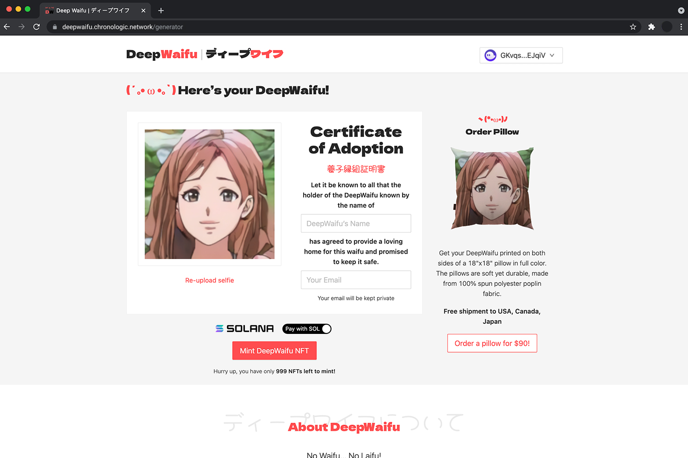
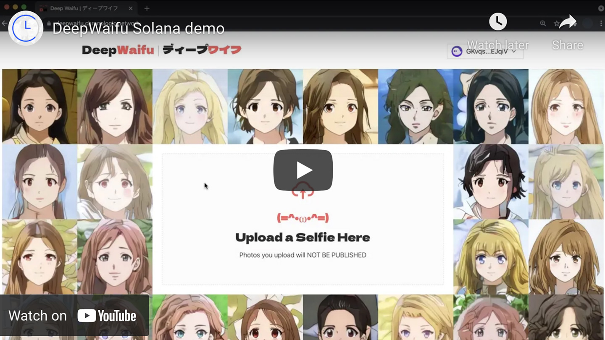

# deep-waifu-payment-contract

This is a part of the [DeepWaifu](https://blog.chronologic.network/no-waifu-no-laifu-we-use-deep-networks-to-draw-your-anime-style-portrait-5fbb0ee6b16a) project.

This repository holds the Solana contract (program) that handles payments for minting the NFTs.

The live version of the dapp can be found [here](https://deepwaifu.chronologic.network/).

## 🗺 Project overview

This project consists of the following repositories:

- https://github.com/chronologic/deep-waifu-ui
- https://github.com/chronologic/deep-waifu-server
- https://github.com/chronologic/deep-waifu-payment-contract (this repository)
- https://github.com/chronologic/deep-waifu-model

## 👀 Demo video

## 💽 Installation

Run `npm install`

## 🚧 Building

Run `anchor build`

Make sure the program ID declared in the `programs/../src/lib.rs` is the same as the key that's used for deployment. The key will be located in `target/deploy/<progra_name>-keypair.json` file. You can check what the current address is by running `solana address -k target/deploy/<program_name>-keypair.json`.

## ✨ Vanity address

If you want a vanity address for the program, you can run `solana-keygen grind --ignore-case --starts-with <desired_prefix>:1` and replace the program keypair with the result.

## 📊 Testing

Run `anchor test`

## 🔗 Deployment

Before deployment, update the `Anchor.toml` file with the following values:

- `[programs:<cluster>] day_mint` - DAY token mint address. This is the token that will be accepted as payment method alternative to SOL.

Run `npm run deploy:<cluster>` to deploy the program.

Run `npm run migrate:<cluster>` to initialize and configure the deployed program.
